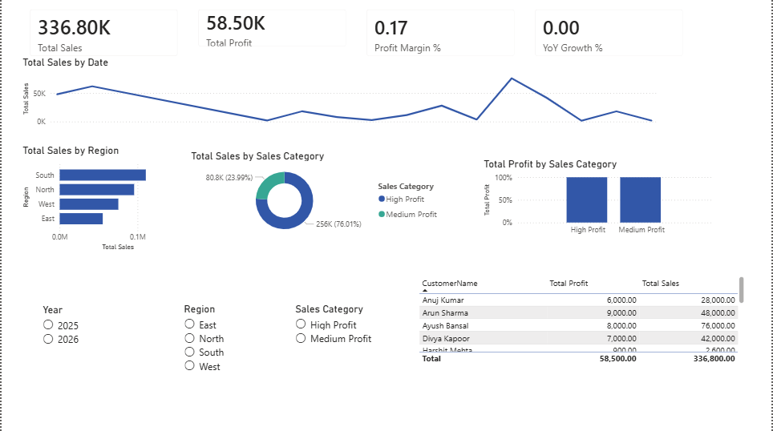
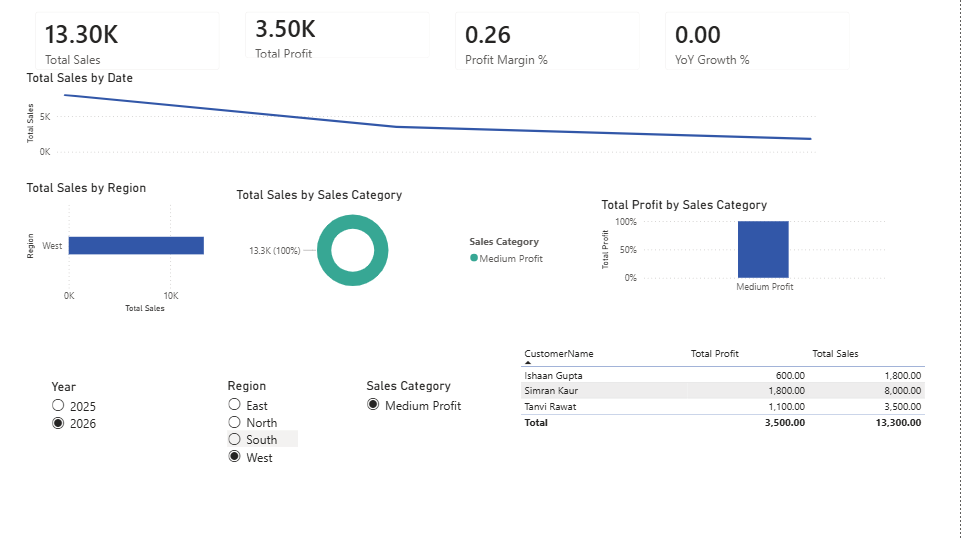
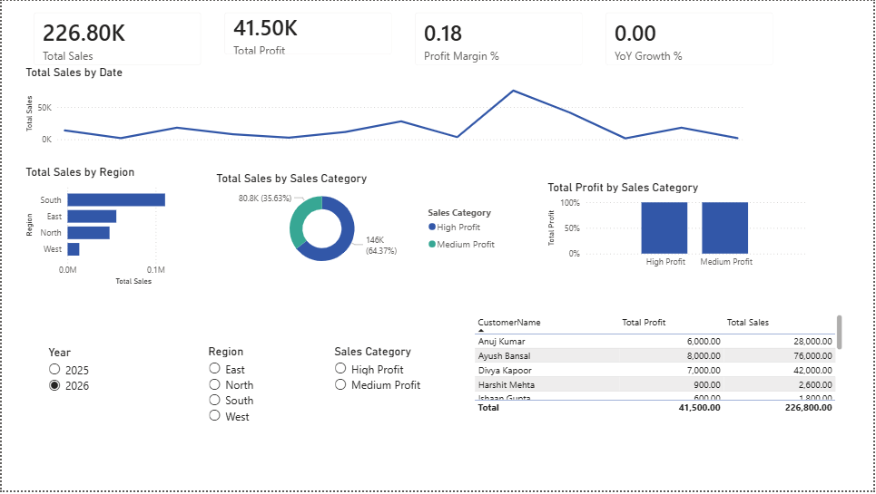

Perfect 👍
Below is a **ready-to-use, professional README.md** that you can **directly copy–paste into GitHub**.
It also **includes the dashboard preview section** (you’ll just add screenshots in the folder).

---

# 📊 Sales Performance Dashboard – 2026 (Power BI)

## 🔍 Project Overview

This project presents an **interactive Sales Performance Dashboard** built using **Power BI**, designed to analyze sales, profit, and growth trends across regions and product categories.
The dashboard helps stakeholders quickly understand **business performance, customer contribution, and year-over-year growth**.

---

## 🛠 Tools & Technologies

* **Power BI Desktop**
* **DAX (Data Analysis Expressions)**
* **Power Query**
* **CSV Dataset**
* **GitHub (Project Hosting)**

---

## 📂 Dataset

The dataset contains transactional sales data for **2025–2026**, including:

* Order Date
* Customer Name
* Region
* Category & Sub-Category
* Sales, Cost, and Profit
* Quantity Sold

File:

```
data/sales_data_2026.csv
```

---

## 🧱 Data Modeling

* Implemented a **Star Schema**
* Created a **dedicated Date Table**
* Established a **Many-to-One relationship** between Sales and Date table
* Marked Date Table for proper **Time Intelligence**

---

## 🧮 Key DAX Measures

Some important measures used in the dashboard:

* **Total Sales**
* **Total Profit**
* **Profit Margin %**
* **Total Orders**
* **Average Order Value**
* **Sales Last Year**
* **Year-over-Year (YoY) Growth %**

These measures dynamically respond to slicers and filters.

---

## 📊 Dashboard Preview

### 🔹 Overall Dashboard



### 🔹 Dashboard with Filters Applied



### 🔹 Sales Trend Analysis



> 📌 *Note: Screenshots are available in the `screenshots/` folder.*

---

## 📈 Key Insights

* Clear visibility into **total sales and profitability**
* Identification of **top-performing regions and categories**
* **Sales trends over time** using line charts
* **Top 10 customers** by revenue
* Easy comparison using **Year, Region, and Category slicers**

---

## 🎯 Dashboard Features

* Interactive **KPI cards**
* Line, bar, column, donut, and table visuals
* Dynamic **slicers** for filtering
* Clean, professional **executive-style layout**

---

## 📁 Repository Structure

```
PowerBI-Sales-Dashboard-2026/
│
├── Sales_Dashboard_2026.pbix
├── data/
│   └── sales_data_2026.csv
├── screenshots/
│   ├── overview.png
│   ├── filters.png
│   └── trends.png
├── README.md
```

---

## 🚀 How to Use

1. Download the repository
2. Open `Sales_Dashboard_2026.pbix` in **Power BI Desktop**
3. Refresh data if required
4. Use slicers to explore insights interactively

---

## 👤 Author

**Akash Gupta**
Aspiring Data Analyst | Power BI | Data Visualization

---

## 📌 Future Enhancements

* Drill-through pages
* Tooltip pages
* Forecasting using time-series
* Deployment via Power BI Service


